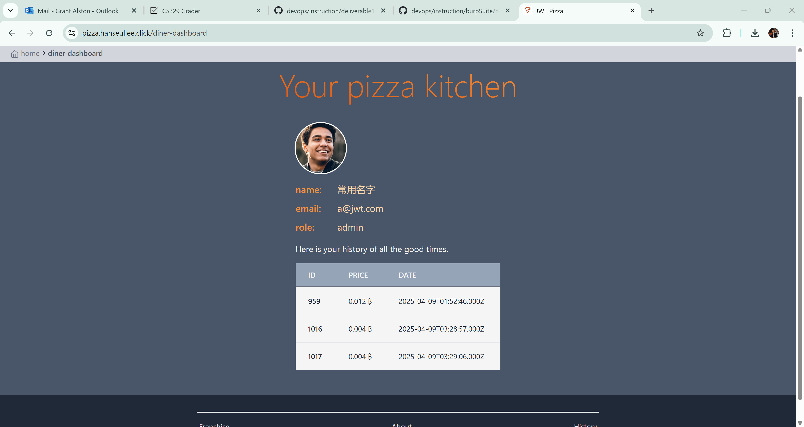
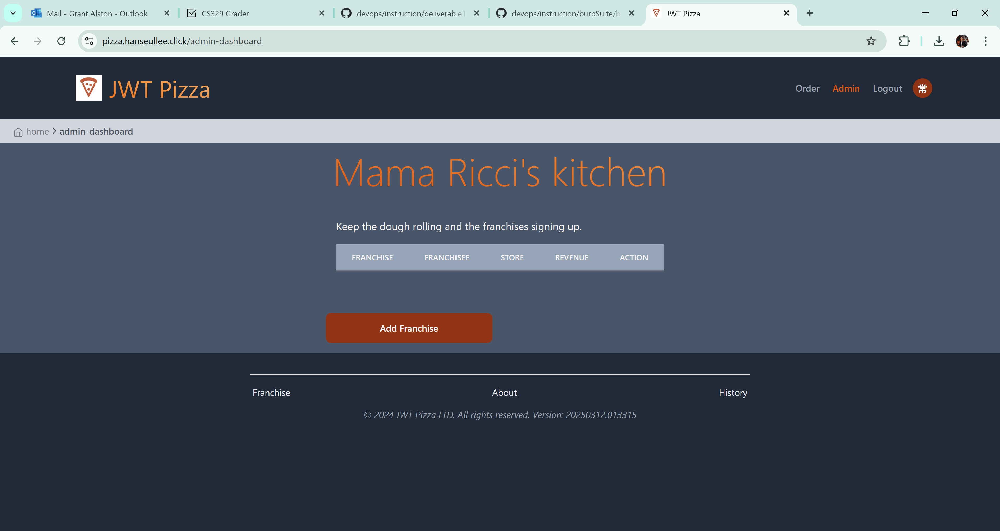

# 🔐 Penetration Test Report – Hanseul and Grant
## Hanseul Self-Attack
| Category        | Details |
|----------------|---------|
| **📅 Date**     | 04/15/2025 |
| **🎯 Target**   | [https://pizza-service.hanseullee.click](https://pizza-service.hanseullee.click) |
| **🏷️ Classification** | Client-side trust issue (Price manipulation) |
| **⚠️ Severity** | High |
| **📝 Description** | The server blindly accepts the `price` field from the client-side request. By intercepting the request and modifying the `price` to `0`, an attacker can purchase any item for free. The server does not validate the price against the actual menu data. |

---


## 🧪 Steps to Reproduce

| Step | Action |
|------|--------|
| 1 | Use **Burp Suite** and enable **Intercept**. |
| 2 | Navigate to the order page on [JWT Pizza](https://pizza.hanseullee.click). |
| 3 | Add items to your cart and click **Pay now**. |
| 4 | Intercept the POST request to `/api/order`. |
| 5 | Modify the JSON payload as shown below: |

```json
{
  "items": [
    { "menuId": 1, "description": "Veggie", "price": 0.0000 },
    { "menuId": 1, "description": "Veggie", "price": 0.0000 },
    { "menuId": 1, "description": "Veggie", "price": 0.0000 }
  ],
  "storeId": "1",
  "franchiseId": "1"
}
```

| 6 | Forward the request. |
| 7 | You will receive a success message, and the pizzas will be ordered for `0 ₿`. |

---

## 🔍 Root Cause

| Issue |
|-------|
| The server trusts the `price` value from the client without verification. The price should be fetched server-side using the `menuId`. |

---

## 🛡️ Recommendations

| Recommendation |
|----------------|
| Do not trust client-supplied price data. |
| Perform server-side lookup of item price via `menuId`. |
| Optionally, sign item data with HMAC or server token to ensure integrity. |

---

## 📸 Evidence

| Screenshot | Description |
|------------|-------------|
|  | Intercepted request in Burp showing manipulated price |
|  | Server accepted 0-price order |
|  | Final confirmation showing total: 0 ₿ |

## Grant Alston Self Test:
| Item            | Result                           |
|-----------------|----------------------------------|
| **Date**        | April 14, 2025                   |
| **Target**      | `pizza.alstogra329.click`       |
| **Classification** | Broken Authentication         |
| **Severity**    |    Critical                    |
| **Description** | Brute force attack was able to guess admin user password |
| **Corrections** | Notify Admin and require more complicated passwords |


# 👥 Peer Penetration Test – JWT Pizza
## Hanseul attcked Grant
## 📅 Date  
04/15/2025

## 🎯 Target  
Admin account of peer deployment (`a@jwt.com`)

## 🧷 Vulnerability  
Guessable default credentials

## ⚠️ Severity  
High

## 📝 Description  
I was able to log in to the peer's admin account using default credentials (`a@jwt.com` / `admin`). After logging in, I had full access to administrative functionality, including deleting franchises.

## 🧪 Steps to Reproduce

| Step | Action |
|------|--------|
| 1 | Go to the login page of the peer's deployment. |
| 2 | Attempt to log in with common credentials such as:<br>`a@jwt.com` / `admin` |
| 3 | Login successful with full admin privileges. |
| 4 | Navigated to the franchise management page. |
| 5 | Deleted all franchise entries. |

## 🔍 Root Cause

| Issue |
|-------|
| The application uses guessable default credentials without enforcing password change upon first login. |

## 🛡️ Recommendations

| Recommendation |
|----------------|
| Enforce secure password policies and require users to change default passwords. |
| Disable or remove default accounts in production. |
| Add rate limiting or CAPTCHA on login to prevent brute-force attacks. |

## 📸 Evidence

| Screenshot | Description |
|------------|-------------|
|  | log in admin account |
|  | Delete stores and frachises |
|  | No stores left |


## Grant Alston Attacking Hanseul Lee:
| Item            | Result                           |
|-----------------|----------------------------------|
| **Date**        | April 15, 2025                   |
| **Target**      | `pizza.hanseullee.click`       |
| **Classification** | Broken Authentication                      |
| **Severity**    |    Critical                    |
| **Description** | Admin user credentials were found using a brute force attack, then were used to delete all stores  |
| **Corrections** | Change the system of giving administrator permissions, and increase password security |

## Steps to Reproduce Attack

1. Use Burp Suite to set up a **Sniper** attack on the `password` field using `"admin"` as the username.
2. Provide a list of possible passwords or use a **pre-generated list of possibilities** in Burp Suite's Payload setup.
3. Run the attack.
4. The correct password will return a **200 status code**.

## Root Cause

Password checking is not implemented and no level of password strength is required

## Recommendations

Use a third-party package for password strength checking and require a certain level of password strength for account creation

## Evidence

| Screenshot | Description |
|------------|-------------|
|  | logged in admin account |
|  | Stores and Franchises Deleted |


## 📚 Combined Summary of Learnings

Through this penetration testing activity, I learned how critical it is to avoid trusting client-side data and how even a small oversight, such as a guessable admin password, can lead to severe vulnerabilities. I also gained hands-on experience with tools like Burp Suite to intercept and manipulate requests and practiced responsible disclosure and documentation of security issues. This exercise emphasized the importance of secure coding practices, validation on the server-side, and good authentication hygiene.
